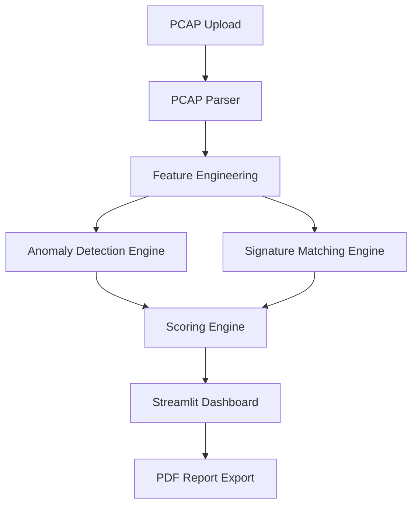

# Technical Documentation: NetShield Architecture

## 1. Project Overview
NetShield is a modular network security tool designed for packet-level anomaly detection. It bypasses the need for complex ML models by using high-performance statistical rules and signature matching.

## 2. Folder Structure & File Purpose
```text
AnomalyDetection/
├── app.py              # Main entry point; handles the UI and orchestration.
├── requirements.txt    # Project dependencies.
├── README.md           # User guide.
├── DOCUMENTATION.md    # Technical deep-dive.
├── generate_test_pcap.py # Utility to create sample attack traffic.
├── modules/            # Core logic components.
│   ├── pcap_parser.py  # Reads PCAP files and extracts raw fields.
│   ├── features.py     # Aggregates raw packets into behavioral features.
│   ├── anomaly_env.py  # Detects statistical outliers (PPS, volume).
│   ├── signatures.py   # Rule-based detection for specific attacks.
│   ├── scoring.py      # Calculates 0-100 threat scores per IP.
│   └── report_gen.py   # Generates PDF summaries using FPDF.
└── assets/             # (Optional) Static images or icons.
```

## 3. System Architecture
NetShield follows a linear processing pipeline:



## 4. Data Flow
1. **Parsing**: `pcap_parser.py` uses Scapy's `PcapReader` to process packets in chunks. It extracts timestamps, IPs, ports, protocols, and TCP flags into a Pandas DataFrame.
2. **Aggregation**: `features.py` groups the DataFrame by `src_ip` and calculates metrics like Packets Per Second (PPS), unique destination ports, and SYN/ACK ratios.
3. **Detection**:
   - **Anomalies**: `anomaly_env.py` calculates the Mean and Standard Deviation of the baseline. Any IP exceeding 3 Sigma (Z-score > 3) is flagged.
   - **Signatures**: `signatures.py` looks for hardcoded patterns (e.g., >20 unique ports in 5 seconds for Port Scanning).
4. **Scoring**: `scoring.py` assigns weights to alerts (High: 50, Critical: 80). Scores are capped at 100.
5. **Visualization**: `app.py` renders Plotly charts and interactive tables.

## 5. Technical Stack & Versions
- **Python (>= 3.10)**: Core language.
- **Streamlit (latest)**: Interactive web framework.
- **Scapy (latest)**: Low-level packet parsing library.
- **Pandas (latest)**: Data manipulation and aggregation.
- **Plotly (latest)**: Dynamic charting.
- **FPDF (latest)**: PDF generation.

## 6. Detailed Detection Rules
| Attack Type | Logic | Alert Severity |
|-------------|-------|----------------|
| Port Scanning | > 20 unique dst_ports from same src_ip. | High |
| SYN Flood | SYN/ACK ratio > 10 with high volume. | Critical |
| ARP Spoofing | Multiple hwsrc (MACs) for a single psrc (IP). | High |
| DNS Tunneling | Avg DNS query length > 50 characters. | High |
| Brute Force | > 20 attempts to sensitive ports (22, 3389). | High |
